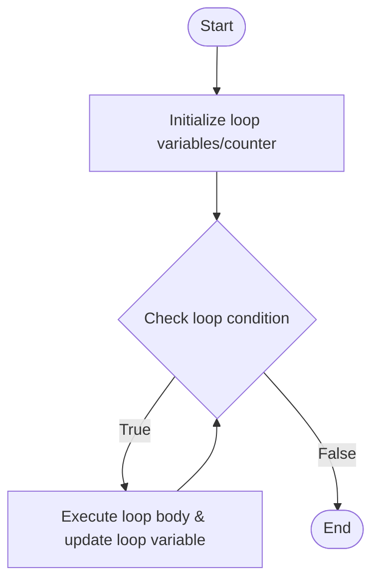

# C# Practice: AdditionalWhileLoop

This project is part of the **CSharpPractice** repository, practicing concepts from **Chapter 1: Variables**.

## Topic
**General**

## Exercise Requirements
C# Practice Exercise for AdditionalWhileLoop.

---

## How to Run

From the repository root directory, execute:
```bash
dotnet run --project AdditionalWhileLoop/AdditionalWhileLoop.csproj
```


---

## 📊 Control Flow Chart



---

## 🧪 Test Cases Spec

| Test Case ID | Test Scenario | Inputs | Expected Output |
| :--- | :--- | :--- | :--- |
| TC01 | Full loop completion | Standard parameters | Output sequence from start to end displayed |
| TC02 | Loop update | Counter increment | Verified loop counter updates exactly as expected |
