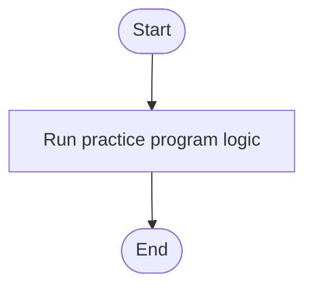

# C# Practice: AssignmentCounter

This project is part of the **CSharpPractice** repository, practicing concepts from **Chapter 2: Operators**.

## Topic
**Arithmetic Operators**

## Exercise Requirements
Implement a AssignmentCounter program using the += operator to increment the counter on variable counter with each iteration. Before each increment, print the counter as shown above. NB: Using While Statement.

---

## How to Run

From the repository root directory, execute:
```bash
dotnet run --project AssignmentCounter/AssignmentCounter.csproj
```


---

## 📊 Control Flow Chart



---

## 🧪 Test Cases Spec

| Test Case ID | Test Scenario | Inputs | Expected Output |
| :--- | :--- | :--- | :--- |
| TC01 | Basic Run | Run program | Verified output matches requirements |
