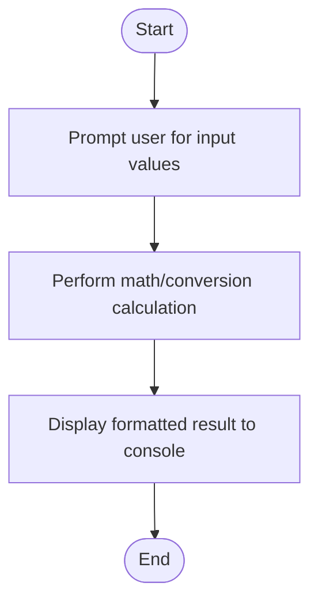

# C# Practice: BMICalculator

This project is part of the **CSharpPractice** repository, practicing concepts from **Chapter 1: Variables**.

## Topic
**General**

## Exercise Requirements
C# Practice Exercise for BMICalculator.

---

## How to Run

From the repository root directory, execute:
```bash
dotnet run --project BMICalculator/BMICalculator.csproj
```


---

## 📊 Control Flow Chart



---

## 🧪 Test Cases Spec

| Test Case ID | Test Scenario | Inputs | Expected Output |
| :--- | :--- | :--- | :--- |
| TC01 | Standard Operation | Valid numbers | Correct calculation output shown |
| TC02 | Boundary inputs | Zero / Negative values | Correctly handles calculation with zero/negative |
| TC03 | Non-numeric Input | "abc" | Throws parsing error / asks for retry |
