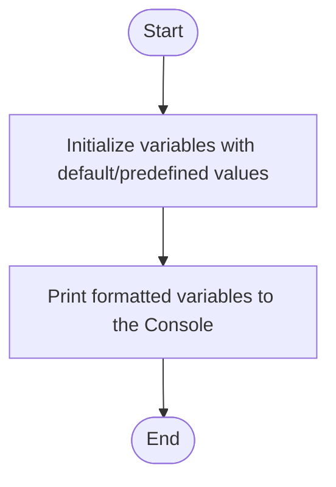

# C# Practice: BasicVariables

This project is part of the **CSharpPractice** repository, practicing concepts from **Chapter 1: Variables**.

## Topic
**Variable Declaration, Initialization, Assignment and Display**

## Exercise Requirements
Write a program (BasicVariables) that declares and initializes variables of appropriate data types and specified values.
myAge initializes with your age.
myHeight initializes with your height.
IsPermentResident initializes with your residency
myNickname initializes with you nickname
myEtimatedNetWorth initializes with your estimate amount of money you are worth.
myLinkedIn initializes with your LinkedIn link
In the BasicVariables program Display the values of these variables on the console with descriptive labels using Console.WriteLine().
In the BasicVariables program experiment with different formatting options

---

## How to Run

From the repository root directory, execute:
```bash
dotnet run --project BasicVariables/BasicVariables.csproj
```


---

## 📊 Control Flow Chart



---

## 🧪 Test Cases Spec

| Test Case ID | Test Scenario | Inputs | Expected Output |
| :--- | :--- | :--- | :--- |
| TC01 | Verify Console Output | None | Displays variables (age, nickname, etc.) with descriptive labels |
| TC02 | Verify Formatting | None | Values display correctly in composite or string interpolation format |
