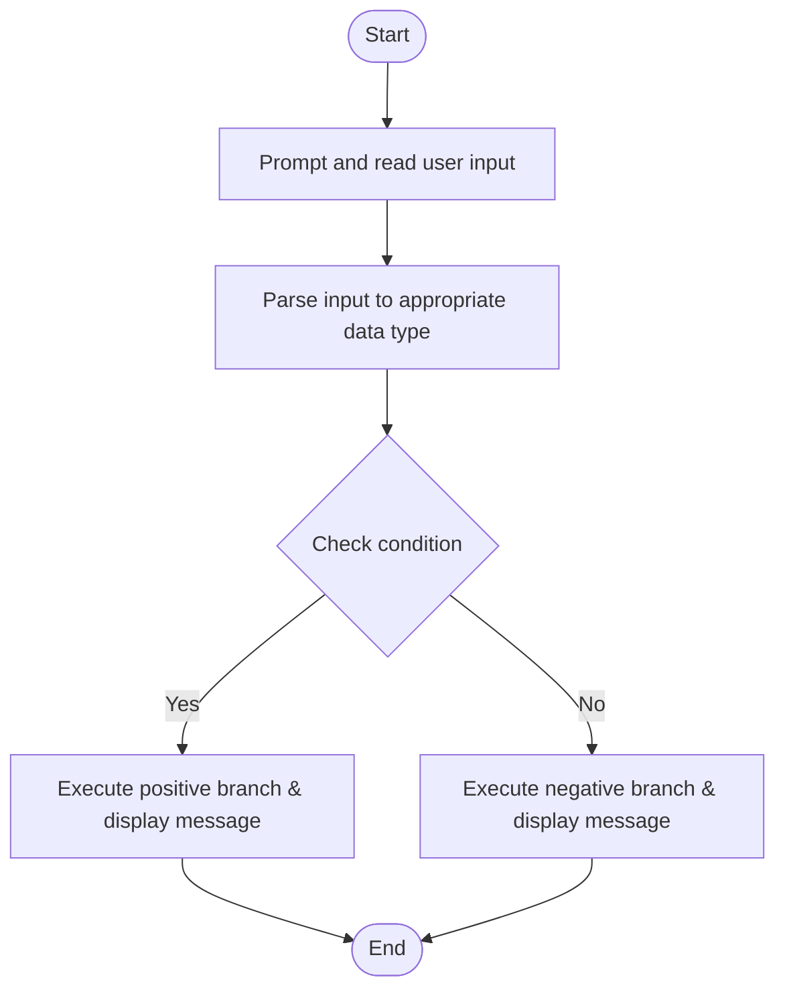

# C# Practice: BooleanVote

This project is part of the **CSharpPractice** repository, practicing concepts from **Chapter 1: Variables**.

## Topic
**Constants**

## Exercise Requirements
Write a program (BooleanVote) that prompts the user to enter their age as an integer. Use a Boolean variable canVote to check if the user is eligible to vote (age >= 18). Display a message indicating whether the user can vote or not. NB: Use IF else statement

---

## How to Run

From the repository root directory, execute:
```bash
dotnet run --project BooleanVote/BooleanVote.csproj
```


---

## 📊 Control Flow Chart



---

## 🧪 Test Cases Spec

| Test Case ID | Test Scenario | Inputs | Expected Output |
| :--- | :--- | :--- | :--- |
| TC01 | Passing Threshold | Positive boundary value | Display success/eligible output |
| TC02 | Failing Boundary | Value below threshold | Display failure/minor/not eligible output |
| TC03 | Edge Input | Null or non-numeric | Handles input parsing exception gracefully |
