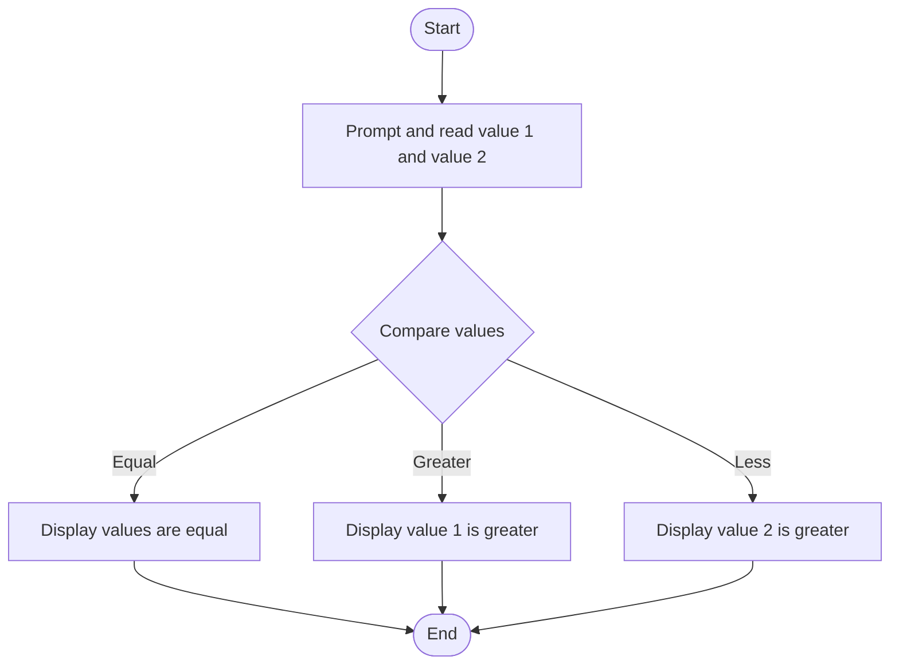

# C# Practice: CompareNumber

This project is part of the **CSharpPractice** repository, practicing concepts from **Chapter 2: Operators**.

## Topic
**Comparison Operators**

## Exercise Requirements
Write a program CompareNumber that compares two numbers (number1 and number2) entered by the user and displays whether the first number is greater, less than, or equal to the second number. Using If else statement

---

## How to Run

From the repository root directory, execute:
```bash
dotnet run --project CompareNumber/CompareNumber.csproj
```


---

## 📊 Control Flow Chart



---

## 🧪 Test Cases Spec

| Test Case ID | Test Scenario | Inputs | Expected Output |
| :--- | :--- | :--- | :--- |
| TC01 | Value 1 Greater | Val1 = 100, Val2 = 10 | Displays Val1 is greater than Val2 |
| TC02 | Value 2 Greater | Val1 = 5, Val2 = 50 | Displays Val1 is less than Val2 |
| TC03 | Values Equal | Val1 = 20, Val2 = 20 | Displays Val1 is equal to Val2 |
