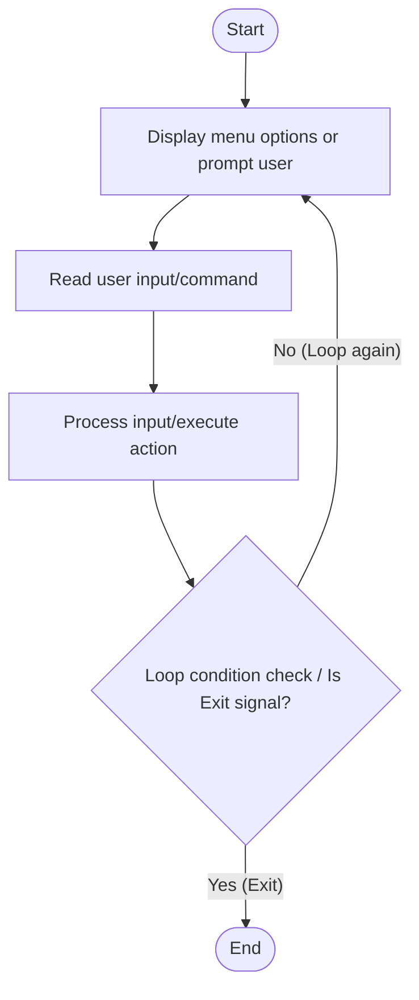

# C# Practice: DoWhileLoopGuessNumber

This project is part of the **CSharpPractice** repository, practicing concepts from **Chapter 1: Variables**.

## Topic
**General**

## Exercise Requirements
C# Practice Exercise for DoWhileLoopGuessNumber.

---

## How to Run

From the repository root directory, execute:
```bash
dotnet run --project DoWhileLoopGuessNumber/DoWhileLoopGuessNumber.csproj
```


---

## 📊 Control Flow Chart



---

## 🧪 Test Cases Spec

| Test Case ID | Test Scenario | Inputs | Expected Output |
| :--- | :--- | :--- | :--- |
| TC01 | Single Option Choice | Enter option code | Processes option logic, displays results |
| TC02 | Multiple Inputs | Loop commands | Loop continues to prompt correctly |
| TC03 | Exit Option | Exit option code | Program terminates cleanly |
