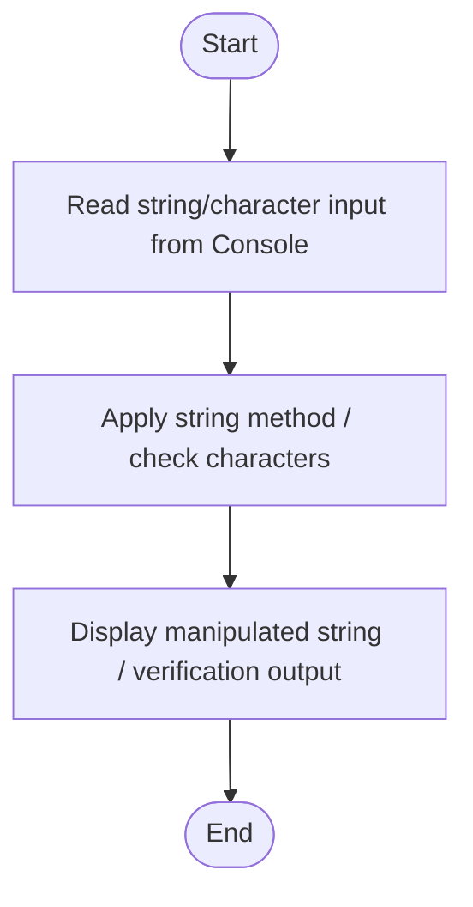

# C# Practice: FirstLettersDisplay

This project is part of the **CSharpPractice** repository, practicing concepts from **Chapter 3: Strings**.

## Topic
**Typical Programs**

## Exercise Requirements
Name Initials: Write a program that asks the user to enter a name (which contact first and middle). Display their initials based on the name entered.
Password Strength Checker: Develop a program that asks the user to enter a password and then checks its strength based on criteria such as length, presence of uppercase letters, lowercase letters, digits, and special characters. Hint: Create a Boolean variable for each criterion (eg. hasLength, hasDigit etc.) and another string variable for strength which uses the criterion to determine if strength is weak, moderate (has strength and one other) or strong (has all).
Text Analysis Tool: Create a program that analyses a user-entered text and displays statistics such as the number of words, characters with space, characters without space.
String Reversal Program: Write a program that reverses a sentence entered by the user while preserving the order of words. Display the reversed sentence. Hint: Spit into array, reverse array using Array.Reverse(words), combine and display.
Simple Encryption Program: Implement a program that encrypts a user-entered message using a simple encryption algorithm (e.g., shifting each letter by a fixed number of positions in the alphabet). Hint: Use Asc() to changer letter to number, Add key and use Chr() to change number to letter.

---

## How to Run

From the repository root directory, execute:
```bash
dotnet run --project FirstLettersDisplay/FirstLettersDisplay.csproj
```


---

## 📊 Control Flow Chart



---

## 🧪 Test Cases Spec

| Test Case ID | Test Scenario | Inputs | Expected Output |
| :--- | :--- | :--- | :--- |
| TC01 | Standard text | "Test String" | Outputs manipulated string correctly |
| TC02 | Empty string | "" | Handles empty string input without crashing |
| TC03 | Special Characters | "!@#$" | String methods process special characters correctly |
