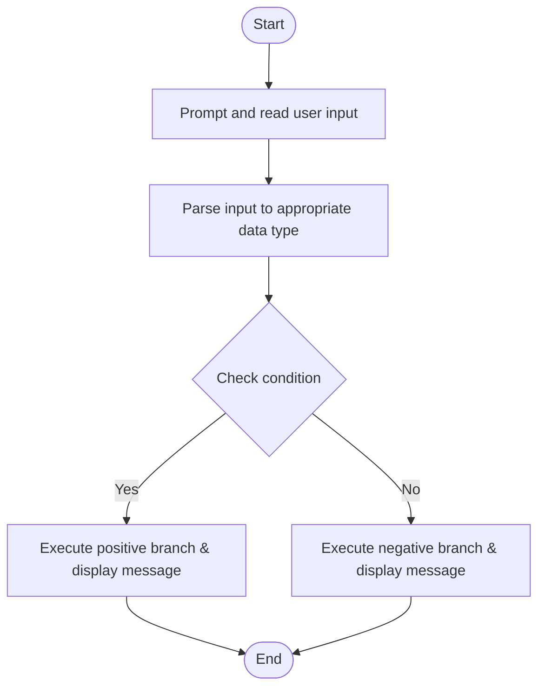

# C# Practice: IfAdultProgram

This project is part of the **CSharpPractice** repository, practicing concepts from **Chapter 4: Selection Control Statement**.

## Topic
**General Exercises**

## Exercise Requirements
Write a program IfAdult that asks the user to enter their age. If the age is greater than or equal to 18, display a message indicating they are an adult; otherwise, display a message indicating they are a minor.

---

## How to Run

From the repository root directory, execute:
```bash
dotnet run --project IfAdultProgram/IfAdultProgram.csproj
```


---

## 📊 Control Flow Chart



---

## 🧪 Test Cases Spec

| Test Case ID | Test Scenario | Inputs | Expected Output |
| :--- | :--- | :--- | :--- |
| TC01 | Passing Threshold | Positive boundary value | Display success/eligible output |
| TC02 | Failing Boundary | Value below threshold | Display failure/minor/not eligible output |
| TC03 | Edge Input | Null or non-numeric | Handles input parsing exception gracefully |
