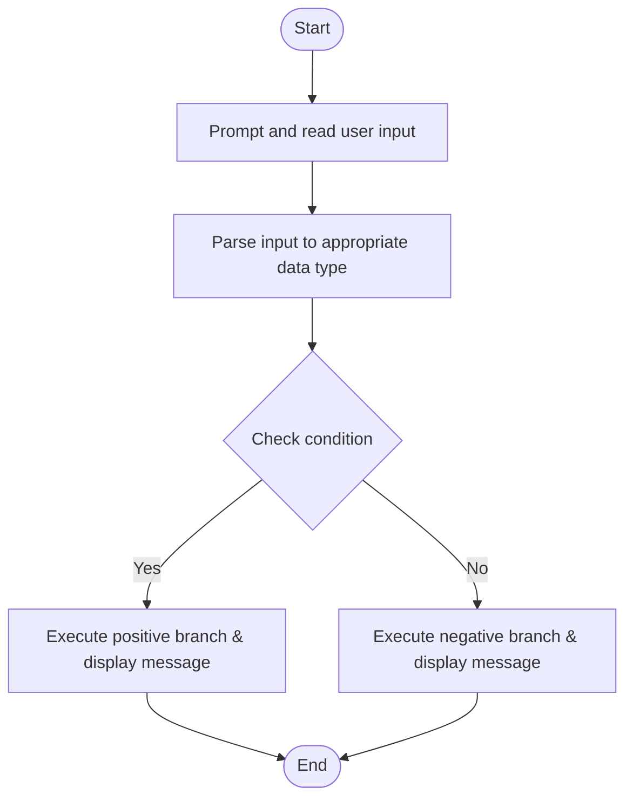

# C# Practice: IfPositiveNumber

This project is part of the **CSharpPractice** repository, practicing concepts from **Chapter 4: Selection Control Statement**.

## Topic
**General Exercises**

## Exercise Requirements
Implement a program ifPositiveNumber that checks if a user-entered number is positive, negative, or zero using If-Else statements.
Nested If-Else Statements

---

## How to Run

From the repository root directory, execute:
```bash
dotnet run --project IfPositiveNumber/IfPositiveNumber.csproj
```


---

## 📊 Control Flow Chart



---

## 🧪 Test Cases Spec

| Test Case ID | Test Scenario | Inputs | Expected Output |
| :--- | :--- | :--- | :--- |
| TC01 | Passing Threshold | Positive boundary value | Display success/eligible output |
| TC02 | Failing Boundary | Value below threshold | Display failure/minor/not eligible output |
| TC03 | Edge Input | Null or non-numeric | Handles input parsing exception gracefully |
