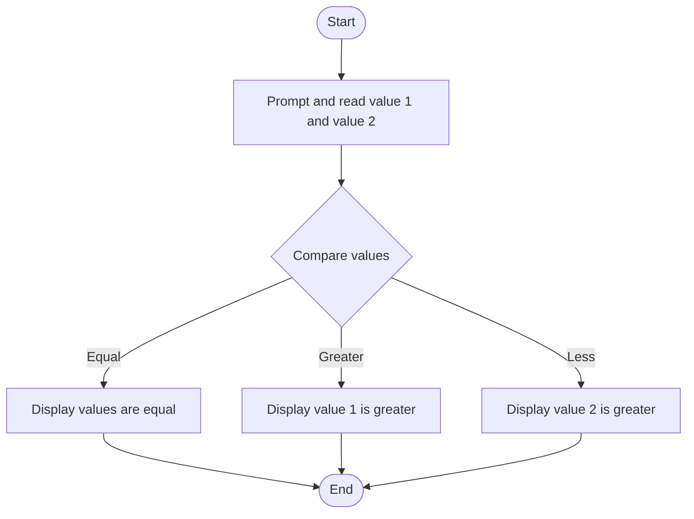

# C# Practice: LogicInRange

This project is part of the **CSharpPractice** repository, practicing concepts from **Chapter 2: Operators**.

## Topic
**Logical Operators**

## Exercise Requirements
Write a program LogicInRange that checks if a number entered by the user is within a specified range (e.g., between 1 and 100) using logical operators (And, Or, Not). NB: Using If statement

---

## How to Run

From the repository root directory, execute:
```bash
dotnet run --project LogicInRange/LogicInRange.csproj
```


---

## 📊 Control Flow Chart



---

## 🧪 Test Cases Spec

| Test Case ID | Test Scenario | Inputs | Expected Output |
| :--- | :--- | :--- | :--- |
| TC01 | Value 1 Greater | Val1 = 100, Val2 = 10 | Displays Val1 is greater than Val2 |
| TC02 | Value 2 Greater | Val1 = 5, Val2 = 50 | Displays Val1 is less than Val2 |
| TC03 | Values Equal | Val1 = 20, Val2 = 20 | Displays Val1 is equal to Val2 |
