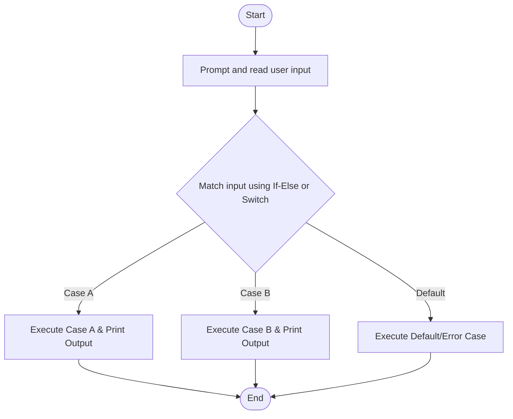

# C# Practice: SelectionWithdraw

This project is part of the **CSharpPractice** repository, practicing concepts from **Chapter 4: Selection Control Statement**.

## Topic
**Selection Control with Boolean Expressions**

## Exercise Requirements
Create a SelectionWithdraw program that simulates a simple ATM. Ask the user to enter their account balance and check if it's greater than zero. If it is, allow them to withdraw money; otherwise, display an error message.

---

## How to Run

From the repository root directory, execute:
```bash
dotnet run --project SelectionWithdraw/SelectionWithdraw.csproj
```


---

## 📊 Control Flow Chart



---

## 🧪 Test Cases Spec

| Test Case ID | Test Scenario | Inputs | Expected Output |
| :--- | :--- | :--- | :--- |
| TC01 | Valid Option A | Select option A | Executes option A branch logic |
| TC02 | Valid Option B | Select option B | Executes option B branch logic |
| TC03 | Invalid Option | Out of bounds option | Displays error message or warning |
