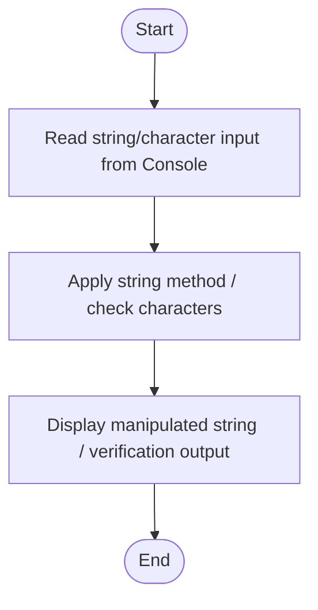

# C# Practice: StringReversalProgram

This project is part of the **CSharpPractice** repository, practicing concepts from **Chapter 1: Variables**.

## Topic
**General**

## Exercise Requirements
C# Practice Exercise for StringReversalProgram.

---

## How to Run

From the repository root directory, execute:
```bash
dotnet run --project StringReversalProgram/StringReversalProgram.csproj
```


---

## 📊 Control Flow Chart



---

## 🧪 Test Cases Spec

| Test Case ID | Test Scenario | Inputs | Expected Output |
| :--- | :--- | :--- | :--- |
| TC01 | Standard text | "Test String" | Outputs manipulated string correctly |
| TC02 | Empty string | "" | Handles empty string input without crashing |
| TC03 | Special Characters | "!@#$" | String methods process special characters correctly |
