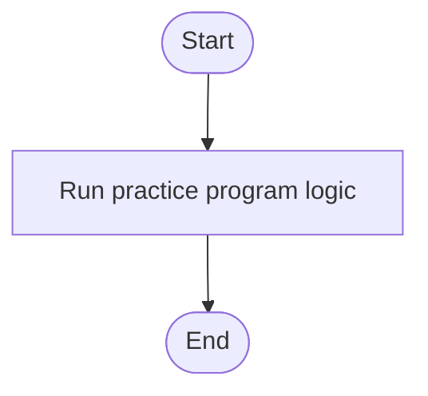

# C# Practice: SwitchMonthProgram

This project is part of the **CSharpPractice** repository, practicing concepts from **Chapter 4: Selection Control Statement**.

## Topic
**Switch Statements**

## Exercise Requirements
Write a program SwitchMonth that converts a user-entered month number (1 for January, 2 for February, etc.) into the corresponding month name using a Switch statement.

---

## How to Run

From the repository root directory, execute:
```bash
dotnet run --project SwitchMonthProgram/SwitchMonthProgram.csproj
```


---

## 📊 Control Flow Chart



---

## 🧪 Test Cases Spec

| Test Case ID | Test Scenario | Inputs | Expected Output |
| :--- | :--- | :--- | :--- |
| TC01 | Basic Run | Run program | Verified output matches requirements |
