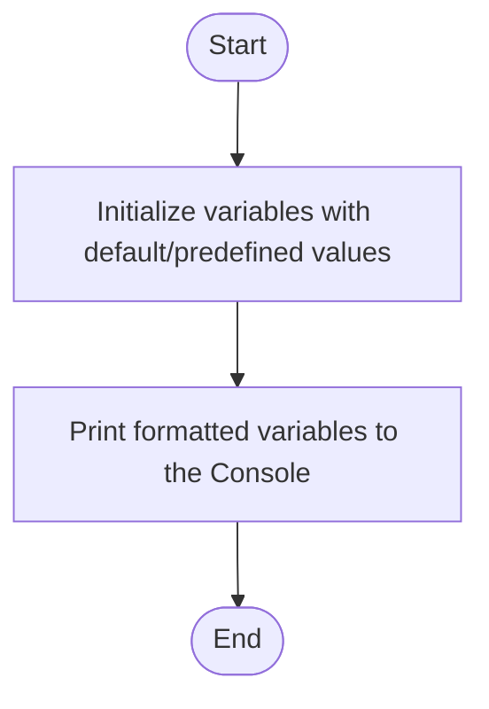

# C# Practice: dataTypesCasting

This project is part of the **CSharpPractice** repository, practicing concepts from **Chapter 1: Variables**.

## Topic
**Data Types and Casting**

## Exercise Requirements
Write a program (TypeAndCastCalculator) that performs arithmetic operations (addition +, division /) on two numeric (number1, number2) variables of type integer which entered by prompting user. Store the result of addition into sum variable and store the result of division into quotient variable.
Apply explicit casting to convert between data types on the following
For all non-string variables, cast them to appropriate data type before assigning into a variable. Use Decimal.Parse() function
For any arithmetic operation that results into a different datatype (i.e. Dividing integers gives a decimal)

---

## How to Run

From the repository root directory, execute:
```bash
dotnet run --project dataTypesCasting/dataTypesCasting.csproj
```


---

## 📊 Control Flow Chart



---

## 🧪 Test Cases Spec

| Test Case ID | Test Scenario | Inputs | Expected Output |
| :--- | :--- | :--- | :--- |
| TC01 | Verify Console Output | None | Displays variables (age, nickname, etc.) with descriptive labels |
| TC02 | Verify Formatting | None | Values display correctly in composite or string interpolation format |
